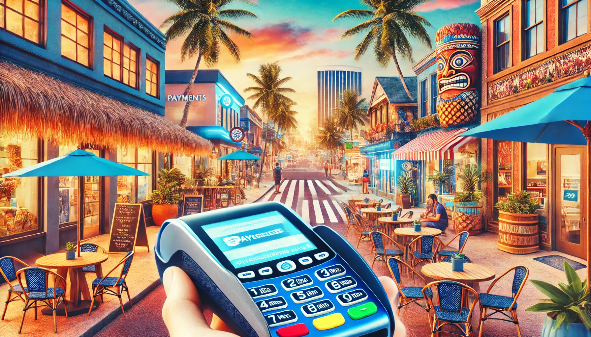
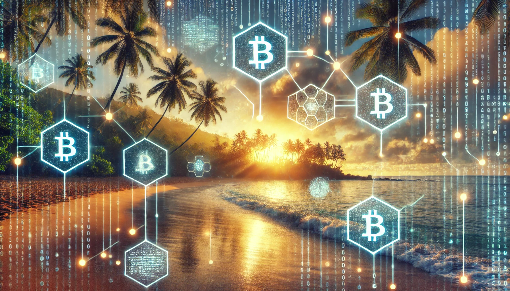
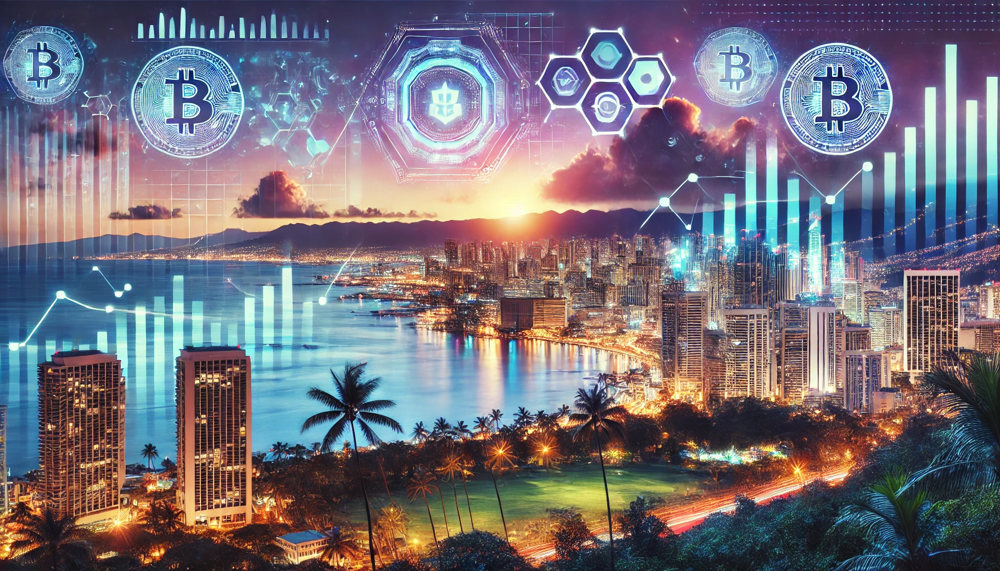

# The Future of Fintech in Hawaii: Market Analysis and Forecast

Hawaii is renowned for its breathtaking landscapes, vibrant culture, and booming tourism industry. Yet beneath the surface of paradise lies a burgeoning fintech scene that is steadily transforming the local economy. In this post, we examine the current state of fintech in Hawaii, explore key market trends, and provide an in-depth forecast of what the future may hold for this dynamic sector.

## Market Overview

The fintech landscape in Hawaii is characterized by a unique blend of local innovation and global influences. Traditional financial institutions, local startups, and innovative entrepreneurs are all playing a role in modernizing how financial services are delivered in the islands.

Key elements of this market include:

- **Digital Payments and Banking:** Local banks and credit unions are increasingly adopting digital platforms, enabling seamless payments and mobile banking experiences for residents and tourists alike.
- **Cryptocurrency and Blockchain:** The rise of blockchain technology has spurred interest in cryptocurrencies, with several local initiatives exploring sustainable crypto mining powered by Hawaii’s abundant renewable energy resources.
- **Tourism-Driven Solutions:** With tourism as a major economic driver, fintech companies are developing solutions that streamline transactions for visitors, improve currency exchange, and integrate digital wallets with local businesses.

## Key Trends in Hawaii Fintech

### Adoption of Digital Payment Solutions

Consumers in Hawaii are rapidly embracing digital payment methods. From mobile wallets to contactless payments, these solutions are driven by both convenience and a need for safer transactions in a post-pandemic world.

### Blockchain and Cryptocurrency Integration

Blockchain technology is making significant inroads into Hawaii’s financial sector. Startups are exploring innovative applications such as decentralized finance (DeFi), while sustainable crypto mining initiatives leverage the state’s renewable energy resources to reduce environmental impact.

### Government and Regulatory Initiatives

The state government has been proactive in fostering fintech innovation. Initiatives like the [Hawaii Blockchain Task Force](https://commerce.hawaii.gov/) aim to create a regulatory environment that encourages experimentation while safeguarding consumers. This supportive framework is essential for attracting both local and international investments.

### Fintech Ecosystem and Collaboration

Hawaii’s fintech ecosystem is becoming increasingly interconnected. Collaborations among local businesses, financial institutions, and tech startups are resulting in innovative solutions that cater to both residents and tourists. Accelerators and incubators are also emerging, providing mentorship and resources for fintech entrepreneurs.

## Challenges Facing the Local Fintech Market

Despite its potential, the fintech scene in Hawaii faces several challenges:

- **Geographical Isolation:** Hawaii’s location can lead to higher operational costs and logistical challenges for tech companies.
- **Market Size:** With a relatively small population, scaling fintech solutions may be limited by the local market size. However, this is often balanced by strong tourism and international interest.
- **Regulatory Uncertainty:** While the government is supportive, the evolving nature of fintech regulation requires companies to stay agile and compliant with changing rules.
- **Infrastructure Constraints:** As demand for digital services grows, investments in robust and secure technological infrastructure become increasingly critical.

## Future Outlook and Forecast

Looking ahead, the future of fintech in Hawaii appears promising, driven by both local and global forces:

- **Increased Digital Adoption:** As digital payment platforms and blockchain technologies mature, more Hawaiians and tourists are expected to adopt these services, driving market growth.
- **Sustainable Innovations:** Leveraging Hawaii’s natural renewable energy resources, fintech companies are likely to lead the way in sustainable crypto mining and eco-friendly financial technologies.
- **Expansion Beyond Local Markets:** Although the local market is small, fintech firms are positioning themselves to serve broader Pacific and international markets. This cross-regional expansion could position Hawaii as a fintech innovation hub.
- **Enhanced Collaboration and Investment:** Ongoing government support and an increasingly collaborative ecosystem are expected to attract further investments, fostering rapid technological advancements and new product development.
- **Evolving Regulatory Framework:** As regulators continue to refine policies, a more predictable and stable business environment will emerge, encouraging innovation while protecting consumer interests.

These trends suggest that Hawaii’s fintech future is set to be one of robust growth and pioneering innovation. Local stakeholders—including entrepreneurs, investors, and government agencies—are uniquely positioned to harness these developments, driving both economic progress and technological advancement across the islands.

## Conclusion

Hawaii’s fintech landscape is a compelling blend of traditional values and modern innovation. From digital payments and blockchain applications to supportive government policies and collaborative ecosystems, the market is evolving rapidly. While challenges remain, the outlook is decidedly optimistic. By embracing fintech solutions and nurturing a forward-thinking regulatory environment, Hawaii is well on its way to becoming a significant player in the global fintech arena.

Mahalo for reading, and stay tuned as we continue to explore the future of fintech in our beautiful islands!

*References:*  
- [Hawaii Blockchain Task Force](https://commerce.hawaii.gov/)  
- [CoinDesk – Fintech Trends](https://www.coindesk.com/)  
- [Hawaii Business Magazine](https://www.hawaiibusiness.com/)
